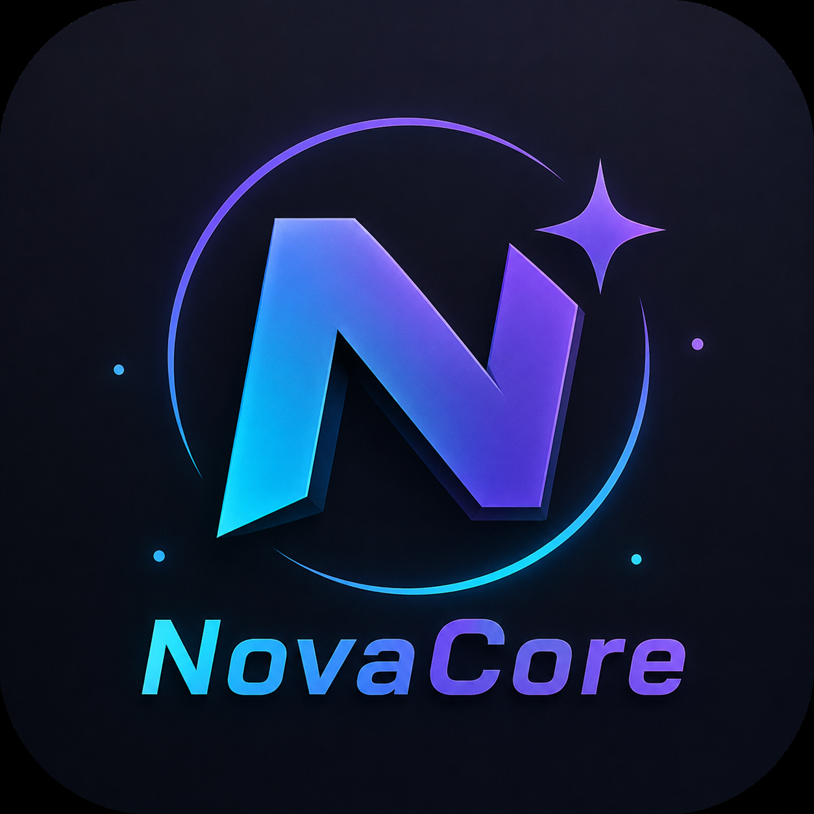

<div align="center">



# NovaCore

A lightweight 2D/3D game engine written in C++, built on SDL2 and OpenGL.

[](https://github.com/Brenninho123/NovaCore/actions/workflows/build.yml)


</div>

---

## Features

- Custom game loop with fixed delta time clamping
- State system (`MenuState` and beyond) for organizing game flow
- Asset manager with caching for textures, sound effects, and music
- Input system with pressed/held/released tracking
- Shader manager built on OpenGL 3.3 core profile (via glad)
- Cross-platform build: Windows (MSVC) and Android (NDK, arm64-v8a)
- Dependency management through vcpkg
- CI builds via GitHub Actions

## Requirements

- CMake 3.16+
- A C++17 compiler (MSVC on Windows, Clang/NDK on Android)
- [vcpkg](https://github.com/microsoft/vcpkg)
- Android NDK (only for Android builds)

## Building (Windows)

```bash
git clone https://github.com/microsoft/vcpkg.git
vcpkg/bootstrap-vcpkg.bat
vcpkg/vcpkg install sdl2 sdl2-image "sdl2-mixer[core,mpg123,vorbis]" opengl glad

cmake -B build -S . -DCMAKE_TOOLCHAIN_FILE=vcpkg/scripts/buildsystems/vcpkg.cmake
cmake --build build --config Release
```

## Building (Android)

```bash
git clone https://github.com/microsoft/vcpkg.git
vcpkg/bootstrap-vcpkg.sh

export ANDROID_NDK_HOME=/path/to/android-ndk

vcpkg/vcpkg install sdl2 sdl2-image "sdl2-mixer[core,mpg123,vorbis]" \
  --triplet arm64-android \
  --overlay-triplets=triplets

cmake -B build -S . \
  -DCMAKE_TOOLCHAIN_FILE=vcpkg/scripts/buildsystems/vcpkg.cmake \
  -DVCPKG_TARGET_TRIPLET=arm64-android \
  -DVCPKG_OVERLAY_TRIPLETS=triplets

cmake --build build
```

## Project structure

```
source/
├── Main.cpp
└── novacore/
    ├── Assets.cpp / Assets.h
    ├── backend/
    │   └── Controls.cpp / Controls.h
    ├── shaders/
    │   └── ShaderManager.cpp / ShaderManager.h
    └── states/
        ├── State.h
        └── MenuState.cpp / MenuState.h
```

## License

Released under the [Unlicense](LICENSE).
